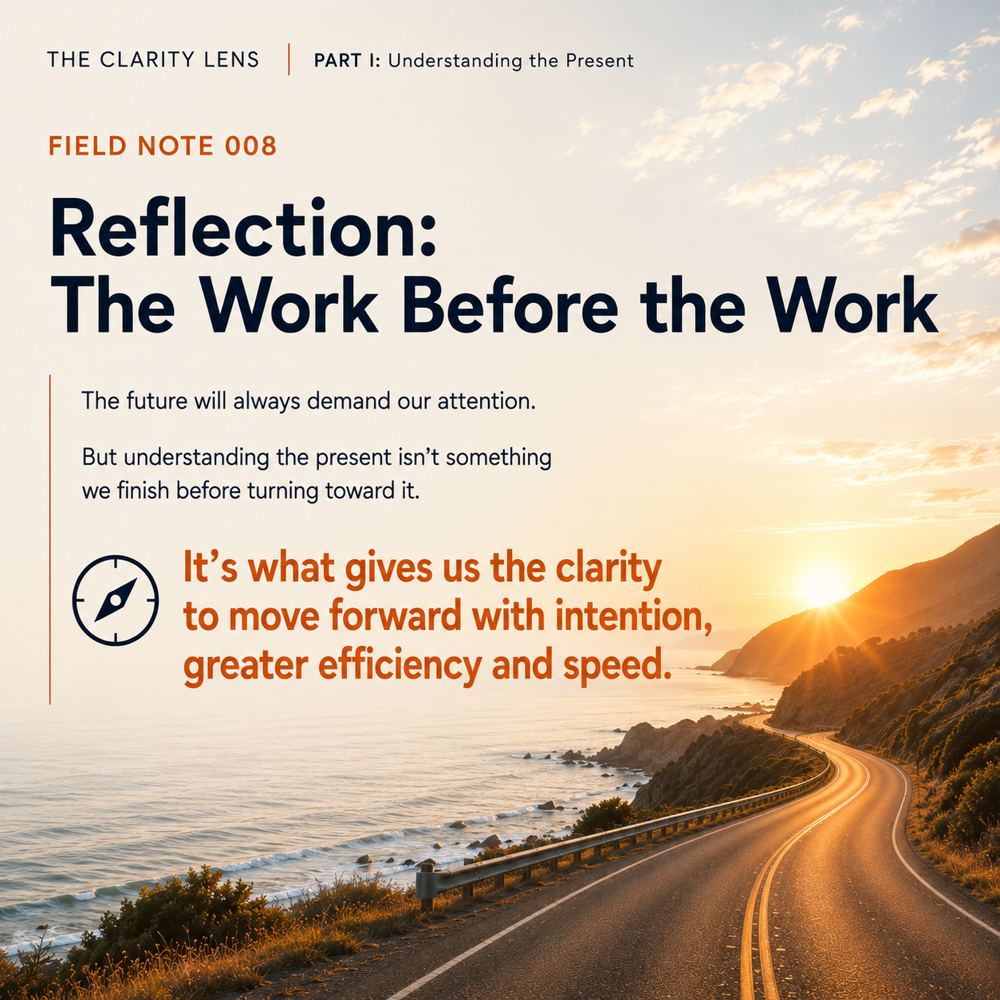

THE CLARITY LENS | PART I: Understanding the Present

Reflection: The Work Before the Work

Organizations spend a lot of time thinking about where they are and where they want to go.

They look at customers, revenue, pipeline, product, the market and the competition. They identify opportunities, set priorities and make plans for growth.

Then the pressure to move takes over.

There are numbers to hit. Pipeline to generate. Products to build. Markets to enter. Revenue to close.

And somewhere in that movement, we can start treating our understanding of the business as settled.

Not because we didn't do the work.

Because we moved on from it too quickly.
Meanwhile, the business keeps teaching us things.

A new customer behaves differently than expected. A market responds in a way we didn't anticipate. A product capability becomes more important. An assumption proves wrong. An opportunity emerges somewhere we weren't looking.

Each is new information about the business we're trying to build.

The question is whether we're continually making sense of it or simply incorporating it into plans already in motion.

Because decisions accumulate. Each may make sense on its own.

But are they collectively making the business stronger?

Are the customers we're winning reinforcing where we create the greatest value? Is what we're building strengthening our differentiation or gradually pulling us away from it? Are we creating the conditions for sustainable growth, or primarily finding ways to make the next number?

This is why understanding the present can't be something we do once and move on from.

It's how we continually make sure the future we're building is supported by what we're learning now.

And Marketing has an interesting role in all of this.

Marketing often asks questions that seem to go beyond their boundaries.

There's a reason.

Marketing has to make the organization make sense to the outside world.

And when those things don't hold together, Marketing often feels it.

Sometimes a messaging problem isn't evidence that Marketing doesn't understand the business. 

The future will always demand our attention.

But understanding the present isn't something we finish before turning toward it.

It's how we continually make sure the future we're building is the right one.

Understanding the present isn't what slows an organization down.

It's what gives us the clarity to move forward with intention, greater efficiency and speed.
