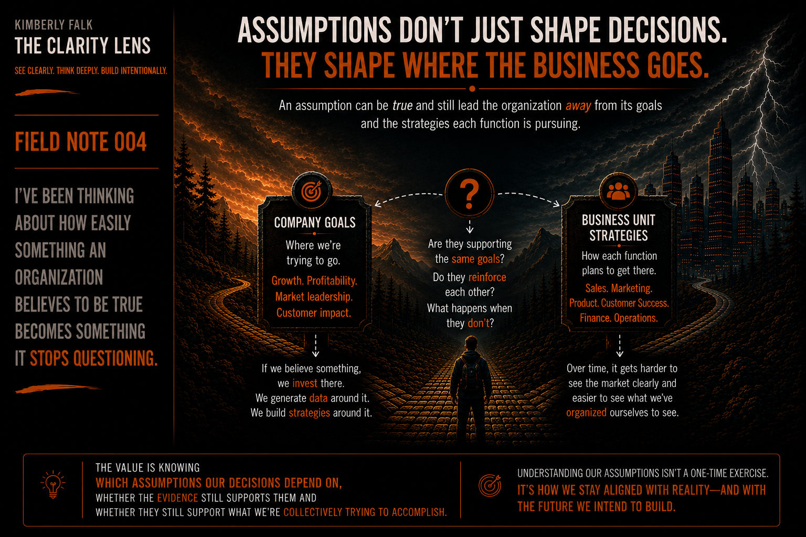

THE CLARITY LENS | PART I: Understanding the Present

FIELD NOTE 004

I've been thinking about how something an organization believes to be true becomes something it stops questioning.

Every organization has assumptions. And many of them begin with evidence.

Customer data suggests this is our ICP. Data tells us what customers value. Win-loss points to a missing capability. Market performance tells us it is, or isn't a good fit.

The assumption isn't necessarily unsupported. It's the conclusion we've drawn from what we've observed.

It's accepted and becomes a fact. And when an assumption becomes widely accepted, it can start to look like shared understanding.

But collectively believing something doesn't make it collectively understood.

Even when an assumption is proven true, there's another question worth asking: Is it true in a way that matters to what we're trying to accomplish?

An assumption can make sense in one part of the business but lead to decisions that work against what another part is trying to achieve.

That's why shared understanding has to consider the assumptions underneath our decisions.

Are they supporting the same company goals? Do they reinforce the strategies each function is pursuing? What happens when they don't?

Assumptions don't just shape our decisions, they can influence them.

If we believe an industry is our best market, we invest there. If we believe we're losing because of a missing capability, Product builds it. If we believe the problem is pipeline, Marketing generates more demand.

Decisions can reinforce an original assumption. More resources go toward it. More data gets generated around it. Strategies get built around it.

We need working assumptions to make decisions. The answer isn't to constantly question everything. But if we're trying to develop a shared understanding of the present, we have to recognize our assumptions.

We need to know what is grounded in evidence, what conclusions we've drawn from it, and whether we're operating from old assumptions.

We should be willing to ask: What do we know? What do we believe? Why do we believe it? What evidence would cause us to reconsider it?

That last question may be the hardest.

It's often easy to find supporting evidence. It can be harder to convince us we might be wrong. 

Not every assumption will be wrong. Many won't.

The value is knowing which assumptions our decisions depend on, whether  evidence still supports them, and whether they support what we're collectively trying to accomplish.

An organization can have tremendous amounts of data and still misunderstand the present if it's interpreting that data through assumptions, or ones no longer relevant.

Shared understanding requires more than agreeing on what we believe, or want to believe. It requires understanding why we believe it.
